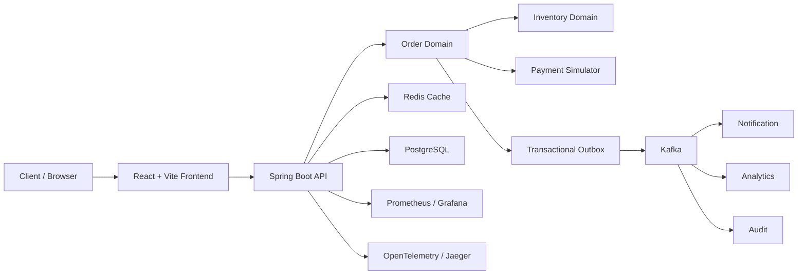

ORDERFLOW

Event-driven distributed commerce platform engineered for correctness,
reliability and scale.

## Live demo
- GitHub Pages URL: https://example.github.io/OrderFlow/
- API URL: http://localhost:8080
- Demo mode: enabled when the public backend is not reachable

## Overview
OrderFlow is a portfolio-grade commerce platform designed to demonstrate how a distributed order flow maintains correctness under concurrency, failures, retries, Kafka-driven processing, and operational observability. It includes catalog, inventory, orders, payment simulation, idempotency, audit, notification, and analytics boundaries without depending on paid infrastructure.

## Architecture


## Features
- Event-driven order processing with outbox and Kafka
- Inventory reservations with optimistic locking
- Idempotent order APIs backed by PostgreSQL
- Payment simulator with retry and compensation
- Redis-backed cache-aside and rate limiting
- JWT security and multi-tenant checks
- Failure lab, DLQ replay, circuit breaker, retry policies
- Docker Compose, Kubernetes, K3s, Terraform, GitHub Actions
- OpenAPI, Prometheus, Grafana, Jaeger, structured logs

## Tech stack
- Java 17 (local verification environment)
- Spring Boot 3.x
- PostgreSQL
- Redis
- Kafka
- React + TypeScript + Vite
- Docker + Docker Compose
- Kubernetes + K3s
- Terraform
- Prometheus + Grafana + OpenTelemetry + Jaeger

## Quick start
```bash
cp .env.example .env
make dev
```

Then open:
- Frontend: http://localhost:5173
- API: http://localhost:8080
- Grafana: http://localhost:3000
- Jaeger: http://localhost:16686

## Docker
```bash
docker compose up -d
```

## Testing
```bash
make test
make integration-test
```

## Load testing
Benchmarking is included under load-tests/k6 and results are emitted under load-tests/results. If real benchmark data has not yet been executed, the repo clearly marks the output as pending instead of inventing numbers.

## Failure lab
Failure scenarios are defined under failure-lab/ and the UI exposes demonstrable, auditable injectable failures without arbitrary code execution.

## Documentation
- [docs/SYSTEM-DESIGN.md](docs/SYSTEM-DESIGN.md)
- [docs/DATA-CONSISTENCY.md](docs/DATA-CONSISTENCY.md)
- [docs/SEQUENCE-DIAGRAMS.md](docs/SEQUENCE-DIAGRAMS.md)
- [docs/ARCHITECTURE-DECISIONS.md](docs/ARCHITECTURE-DECISIONS.md)
- [docs/FAILURE-INJECTION.md](docs/FAILURE-INJECTION.md)
- [docs/LOAD-TESTING.md](docs/LOAD-TESTING.md)
- [docs/RUNBOOK.md](docs/RUNBOOK.md)
- [docs/DISASTER-RECOVERY.md](docs/DISASTER-RECOVERY.md)
- [docs/SECURITY.md](docs/SECURITY.md)
- [docs/API.md](docs/API.md)
- [docs/DEPLOYMENT.md](docs/DEPLOYMENT.md)
- [docs/ENGINEERING-BLOG.md](docs/ENGINEERING-BLOG.md)

## CI/CD
GitHub Actions workflows live under .github/workflows and include frontend, backend, Docker, security, and deployment templates.

## Oracle deployment notes
The repository is designed to run on a resource-conscious Oracle Cloud Always Free footprint with K3s and ARM64-compatible images, but actual cloud deployment requires valid Oracle credentials and a provisioned VM.

## Benchmark status
Benchmark pending.

## License
MIT
