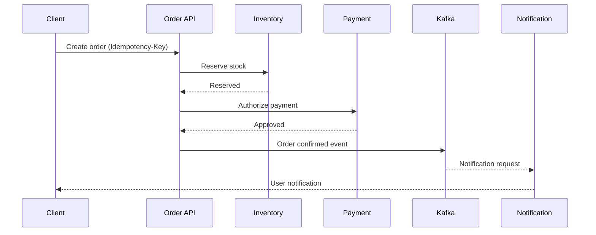
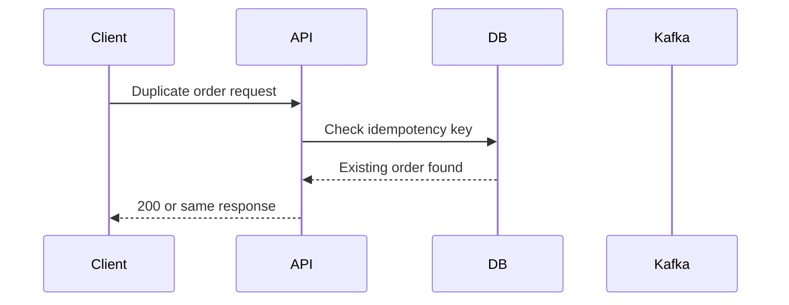
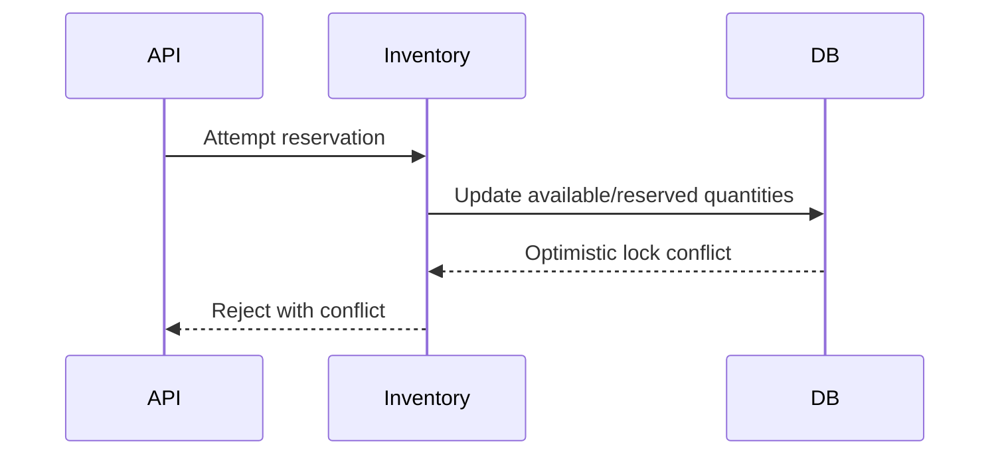

# Sequence Diagrams

```mermaid
sequenceDiagram
  participant Client
  participant API as Order API
  participant Inventory
  participant Payment
  participant Kafka
  participant Notification

  Client->>API: Create order (Idempotency-Key)
  API->>Inventory: Reserve stock
  Inventory-->>API: Reserved
  API->>Payment: Authorize payment
  Payment-->>API: Approved
  API->>Kafka: Order confirmed event
  Kafka-->>Notification: Notification request
  Notification-->>Client: User notification
```

```mermaid
sequenceDiagram
  participant Client
  participant API
  participant DB
  participant Kafka

  Client->>API: Duplicate order request
  API->>DB: Check idempotency key
  DB-->>API: Existing order found
  API-->>Client: 200 or same response
```

```mermaid
sequenceDiagram
  participant API
  participant Inventory
  participant DB

  API->>Inventory: Attempt reservation
  Inventory->>DB: Update available/reserved quantities
  DB-->>Inventory: Optimistic lock conflict
  Inventory-->>API: Reject with conflict
```
